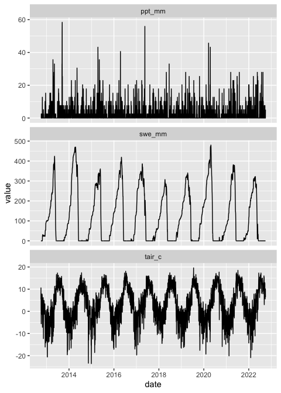

Access and format SNOTEL data
================
Keith Jennings
2023-04-14

# Intro and dependencies

This page details how to access
[SNOTEL](https://www.nrcs.usda.gov/wps/portal/wcc/home/aboutUs/monitoringPrograms/automatedSnowMonitoring)
data and format it for use with the `snowBMI` model.

To run the code, you’ll need:

- An updated version of [R](https://www.r-project.org/)
- Three R packages:
  - `tidyverse`
  - `snotelr`
  - `zoo`

You can access each of the packages above through
[CRAN](https://cran.r-project.org/) or in an R session by running
`install.packages("packagename")` where “packagename” is, well, the
package name (e.g., `install.packages("tidyverse)`).

Additionally, you may want to use an IDE like
[RStudio](https://posit.co/download/rstudio-desktop/) to develop and run
your R scripts and manage R packages.

# Get the data

First, start your R session and load the required packages.

``` r
library(tidyverse)
library(snotelr)
library(zoo)
```

Next, use the `snotelr` package to get info on the SNOTEL stations and
download a particular site.

``` r
# Import SNOTEL metadata 
# You don't need this if you know your site number
meta <- snotel_info()

# Pick a site number and download data
# I'm going to choose site 663, Niwot Ridge
site_no = 663
df <- snotel_download(site_id = site_no, internal = TRUE) %>% 
  mutate(date = as.Date(date))
```

You can use the whole date range of valid data if you want, but I’m
going to filter the time series to a 10-year span.

``` r
# First make a date sequence
date_seq = seq.Date(from = as.Date("2012-10-01"), to = as.Date("2022-09-30"),
                    by = "1 day")

# Then subset to that sequence
df <- df %>% 
  filter(date %in% date_seq) 
```

# Format the data

For the `snowBMI` model we only need air temperature and precipitation,
but we’ll also keep the snow water equivalent (SWE) data for plotting
and comparisons.

``` r
df <- df %>% 
  select(date, 
         swe_mm = snow_water_equivalent,
         tair_c = temperature_mean,
         ppt_mm = precipitation)
```

Now that we have the data we want, we’re all set to go, right? Not so
fast.

If we check the data we find there are 7 missing entries for `tair_c`
and 5 for `ppt_mm`.

`snowBMI` is but a simple model without any NA handling, so we want to
give it serially complete data. We can do this by linearly interpolating
the missing `tair_c` values and setting missing `ppt_mm` values to 0.

``` r
df <- df %>% 
  mutate(tair_c = na.approx(tair_c),
         ppt_mm = case_when(is.na(ppt_mm) ~ 0, TRUE ~ ppt_mm))
```

We can check the data again and see that we now have 0 missing entries
for `tair_c` and 0 for `ppt_mm`.

# Export the data

We’ll now write the data to a csv file in the project directory.
**NOTE:** These data come with the project, so I’ve commented out the
following code. Remove the hashtags and change the output directory if
you want SNOTEL data in a different location.

``` r
# write.csv(x = df, 
#           file = paste0("../data/snotel_", site_no, "_data.csv"), 
#           row.names = F, 
#           quote = F)
```

# Look at the data

If for some reason you want to see a bunch of squiggly lines, then you
are in luck. Below are the plots for the data we’ve saved.

``` r
# plot code
df %>% pivot_longer(!date, names_to = "var", values_to = "value") %>% 
  ggplot(aes(date, value)) +
  geom_line() + 
  facet_wrap(~var, ncol = 1, scales = "free_y")
```

<!-- -->

Nailed it!

Now, let’s try running `snowBMI` with these data.

# References

- Hufkens K (2022). “snotelr: a toolbox to facilitate easy SNOTEL data
  exploration and downloads in R.”
  <https://doi.org/10.5281/zenodo.7012728>,
  <https://bluegreen-labs.github.io/snotelr/>.
